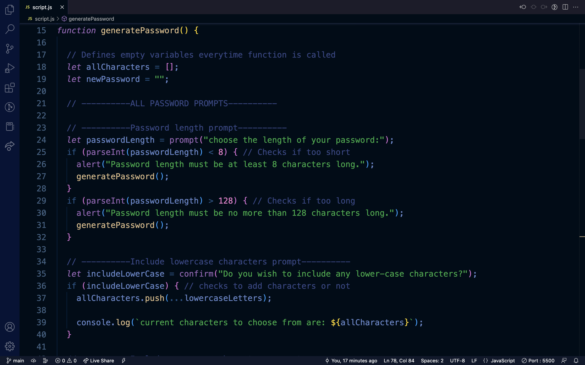

# JavaScript-Password-Generator

## Description:
  
This portfolio is where I'll be showing off any cool projects or recent code I've been working on. Its is currently more of a work in progress that I intend to expand upon as my skills expand as well.
  - My motivation for this project was to learn more about problem solving. Learning to take on issues one at a time will become more and more helpful when coding future projects.
  - I built this password generator to practise responding to user-input using javascript.
  - Building this project i familiarized myself more with using prompts and confirms, as well as the spread operator.
  
## Installation:
This project can be viewed using the live server or view in default browser extensions in VScode.

Or it can be viewed on github pages here: https://mo2207.github.io/Javascript-Password-Generator/

## Usage:

## Credits:
This project was done by myself, and with a lot of google.

## License:
MIT license
